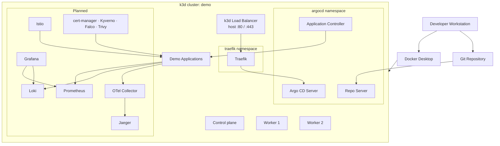
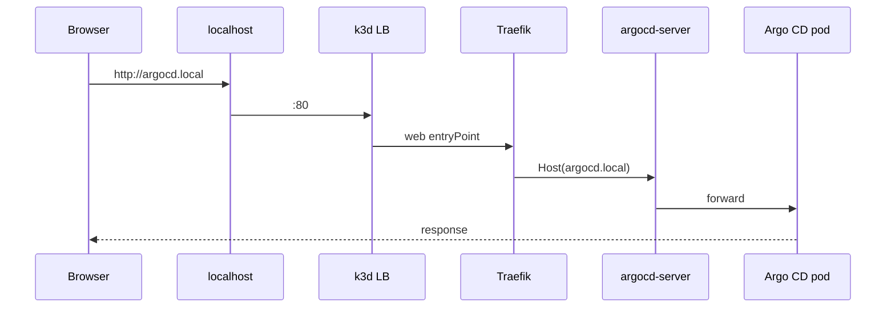
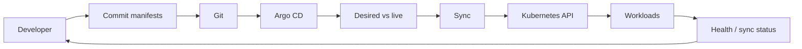

# k3d GitOps Lab

A local, production-style Kubernetes lab for learning **GitOps**, **ingress**, **observability**, **service mesh**, and **DevSecOps** — without cloud spend. The stack centers on [k3d](https://k3d.io/), [Traefik](https://traefik.io/), and [Argo CD](https://argo-cd.readthedocs.io/), with a phased path to Prometheus, Grafana, Loki, OpenTelemetry, Istio, security tooling, and CI/CD.

**Cluster name:** `demo` · **Nodes:** 1 server + 2 agents · **Ingress host:** `argocd.local`

---

## Table of contents

- [Quick start](#quick-start)
- [What’s in this repo](#whats-in-this-repo)
- [Architecture](#architecture)
- [Prerequisites](#prerequisites)
- [Install & validate](#install--validate)
- [Access Argo CD](#access-argo-cd)
- [GitOps model](#gitops-model)
- [Roadmap & phases](#roadmap--phases)
- [Operations](#operations)
- [Troubleshooting](#troubleshooting)
- [Related docs](#related-docs)
- [License](#license)

---

## Quick start

**Prerequisites:** Docker Desktop running, `k3d` and `kubectl` installed ([details](#prerequisites)).

```bash
git clone <your-repo-url>
cd k3d-gitops-lab

# 1. Create cluster (ports 80/443 on localhost → load balancer)
k3d cluster create --config infra/k3d/k3d-cluster.yaml

# 2. Install Argo CD
kubectl create namespace argocd
kubectl apply -n argocd -f https://raw.githubusercontent.com/argoproj/argo-cd/stable/manifests/install.yaml
kubectl wait --for=condition=Available deployment --all -n argocd --timeout=300s

# 3. Open UI (until Traefik ingress is configured)
kubectl port-forward svc/argocd-server -n argocd 8080:443
```

Open **https://localhost:8080** — user `admin`, password:

```bash
kubectl -n argocd get secret argocd-initial-admin-secret \
  -o jsonpath="{.data.password}" | base64 -d && echo
```

For Traefik + `http://argocd.local`, follow [Install Traefik](#install-traefik) and [Ingress access](#option-2-traefik-ingressroute).

---

## What’s in this repo

| Path | Description |
| --- | --- |
| [`infra/k3d/k3d-cluster.yaml`](infra/k3d/k3d-cluster.yaml) | k3d cluster: `demo`, 1 server, 2 agents, host ports 80/443 |
| [`kubernetes/argocd/argocd-ingressroute.yaml`](kubernetes/argocd/argocd-ingressroute.yaml) | Traefik `IngressRoute` for `argocd.local` → `argocd-server:80` |
| [`k3d_gitops_lab_execution_plan.md`](k3d_gitops_lab_execution_plan.md) | Full phased build plan (Phases 0–10) |
| [`medium/`](medium/) | Long-form write-up for publication |
| [`LICENSE`](LICENSE) | MIT |

**Checked in today:** cluster config + Argo CD ingress manifest.  
**Planned:** Argo CD `Application` manifests, Helm values, demo apps, observability/security stacks, GitHub Actions.

---

## Architecture



### Request path (ingress)



### Component status

| Component | Status | Role |
| --- | --- | --- |
| Docker Desktop | Required | Container runtime for k3d |
| k3d + `demo` cluster | **In repo** | Local Kubernetes |
| Traefik | Manual install | Ingress / routing |
| Argo CD | Manual install | GitOps controller |
| Prometheus / Grafana | Planned | Metrics & dashboards |
| Loki / Fluent Bit | Planned | Log pipeline |
| OpenTelemetry / Jaeger | Planned | Traces |
| Istio | Planned | Service mesh, mTLS, traffic policy |
| Security stack | Planned | certs, admission, runtime, scanning |
| GitHub Actions | Planned | Lint, validate, scan before sync |

---

## Prerequisites

**macOS (Homebrew):**

```bash
brew install kubectl k3d helm terraform argocd jq
```

Install and start [Docker Desktop](https://www.docker.com/products/docker-desktop/).

**Validate:**

```bash
docker version
kubectl version --client
helm version
k3d version
```

---

## Install & validate

### Create the cluster

From the repo root:

```bash
k3d cluster create --config infra/k3d/k3d-cluster.yaml
kubectl get nodes
kubectl get pods -A
```

Expect one control-plane node, two workers, and healthy system pods.

### Install Traefik

k3s may ship Traefik by default. Check before installing a second instance:

```bash
kubectl get pods -A | grep -i traefik
```

To use only Helm-managed Traefik, disable the k3s add-on in `k3d-cluster.yaml` and recreate the cluster.

```bash
helm repo add traefik https://traefik.github.io/charts
helm repo update
kubectl create namespace traefik
helm install traefik traefik/traefik -n traefik --set service.type=LoadBalancer
kubectl get pods,svc -n traefik
```

### Install Argo CD

```bash
kubectl create namespace argocd
kubectl apply -n argocd -f \
  https://raw.githubusercontent.com/argoproj/argo-cd/stable/manifests/install.yaml
kubectl wait --for=condition=Available deployment --all -n argocd --timeout=300s
kubectl get pods -n argocd
```

---

## Access Argo CD

### Option 1: Port-forward

```bash
kubectl port-forward svc/argocd-server -n argocd 8080:443
```

→ **https://localhost:8080** (user `admin`, password from [quick start](#quick-start))

### Option 2: Traefik IngressRoute

```bash
kubectl apply -f kubernetes/argocd/argocd-ingressroute.yaml
sudo sh -c 'echo "127.0.0.1 argocd.local" >> /etc/hosts'
```

→ **http://argocd.local** (Traefik `web` entryPoint → `argocd-server:80`)

---

## GitOps model



1. Store manifests in Git.  
2. Register Argo CD `Application` resources.  
3. Let Argo CD reconcile cluster state to Git.  
4. Prefer sync over ad-hoc `kubectl apply` for app/platform changes.  
5. Add observability and policy checks as phases mature.

---

## Roadmap & phases

Phases are detailed in [`k3d_gitops_lab_execution_plan.md`](k3d_gitops_lab_execution_plan.md). Summary:

| Phase | Focus |
| --- | --- |
| 0 | Workstation tooling |
| 1 | k3d cluster (**current**) |
| 2 | GitOps — Traefik + Argo CD |
| 3 | Observability — Prometheus, Grafana, Loki, Fluent Bit |
| 4 | Demo apps — podinfo, httpbin, nginx, redis, load gen |
| 5 | OpenTelemetry + Jaeger |
| 6 | External access — Cloudflare Tunnel |
| 7 | Istio service mesh |
| 8 | Security — cert-manager, Kyverno, Falco, Trivy |
| 9 | CI/CD — GitHub Actions (lint, kubeconform, scan) |
| 10 | Advanced scenarios |

**Phase 3+ (high level):** create `monitoring` namespace, install `kube-prometheus-stack`, `loki-stack`, Fluent Bit, then OTel Collector and Jaeger via Helm — see the execution plan for exact commands and validation steps.

Validate and commit after each phase so the lab stays reproducible.

---

## Operations

```bash
kubectl get nodes
kubectl get pods -A
kubectl get pods,svc -n traefik
kubectl get pods,svc -n argocd
k3d cluster list
k3d cluster delete demo
k3d cluster create --config infra/k3d/k3d-cluster.yaml
```

---

## Troubleshooting

| Symptom | Check |
| --- | --- |
| `kubectl` can’t connect | `docker ps`, `k3d cluster list`, `kubectl config current-context` |
| `argocd.local` won’t resolve | `grep argocd.local /etc/hosts` |
| Ingress not routing | `kubectl get pods,svc -n traefik`, `kubectl get svc -n argocd argocd-server`, `kubectl describe ingressroute -n argocd argocd` |
| Port 80/443 in use | Stop conflicting service or edit port mappings in `infra/k3d/k3d-cluster.yaml` |

---

## Related docs

| Document | Description |
| --- | --- |
| [Execution plan](k3d_gitops_lab_execution_plan.md) | Step-by-step phases 0–10 with commands |
| [Medium article draft](medium/building-a-local-gitops-platform-with-k3d-argocd-and-traefik.md) | Narrative guide for the same lab |

---

## License

MIT License — see [LICENSE](LICENSE).
